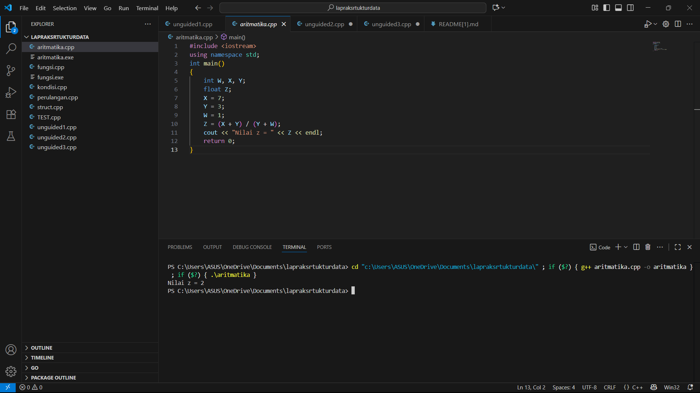
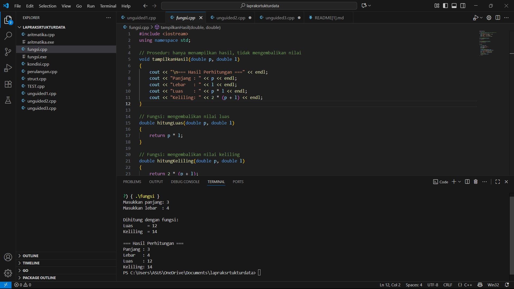
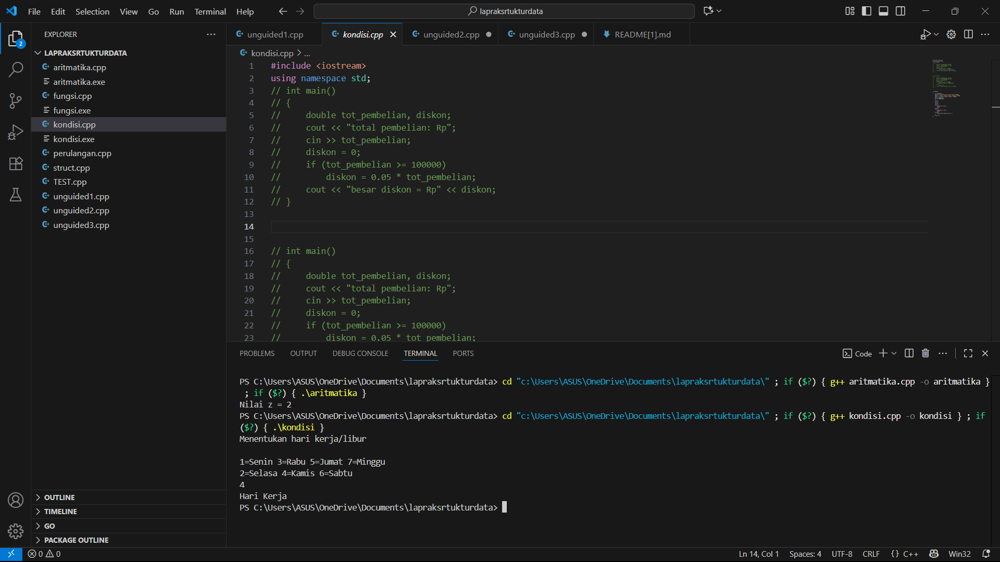
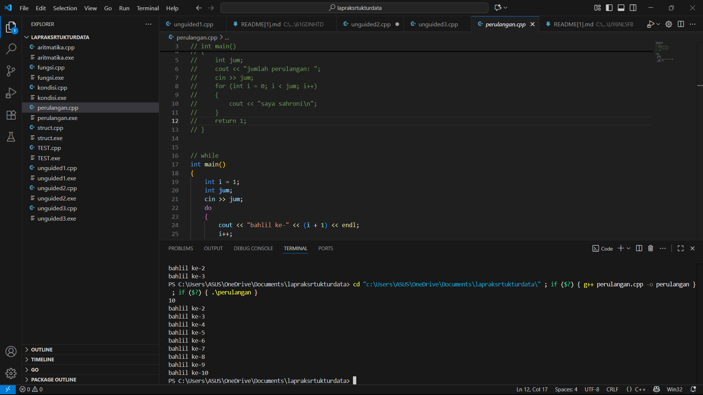
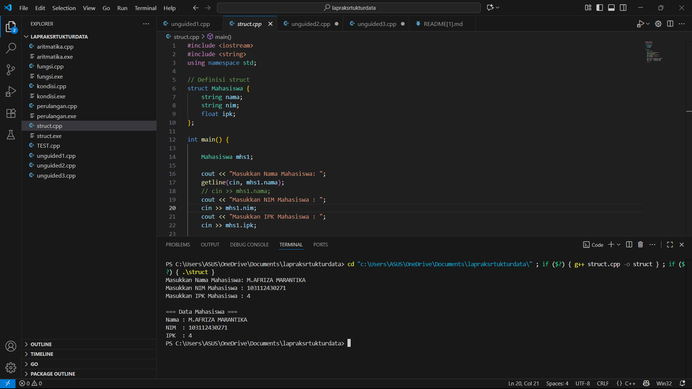
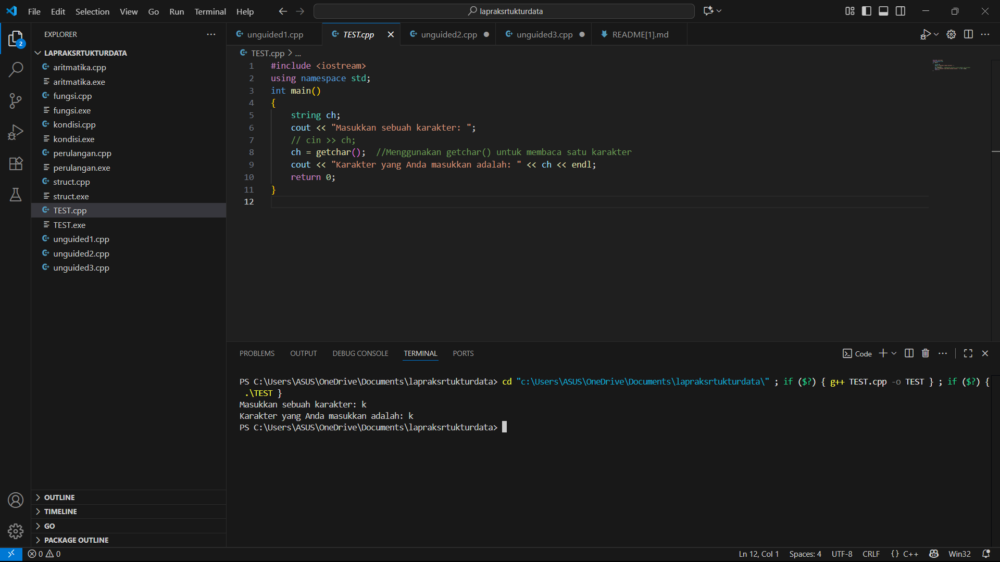

# <h1 align="center">Laporan Praktikum Modul 1 <br> PENGENALAN C++ </h1>
<p align="center">M.AFRIZA MARANTIKA - 103112430271</p>

## Dasar Teori

C++ merupakan bahasa pemrograman yang dikembangkan oleh Bjarne Stroustrup pada awal tahun 1980-an pada Bell Laboratories. C++ merupakan pengembangan dari bahasa C menggunakan penambahan konsep pemrograman berorientasi objek (Object-Oriented Programming / OOP), sehingga dapat digunakan untuk membangun perangkat lunak dari skala kecil hingga besar dengan lebih efisien. C++ tetap menjadi salah satu bahasa pemrograman penting yang digunakan untuk pengembangan berbagai jenis perangkat lunak sampai saat ini.

## guided

### aritmatika
```c++
#include <iostream>
using namespace std;
int main()
{
    int W, X, Y;
    float Z;
    X = 7;
    Y = 3;
    W = 1;
    Z = (X + Y) / (Y + W);
    cout << "Nilai z = " << Z << endl;
    return 0;
}

```
> Output
> 
Program ini menghitung nilai Z dengan rumus (X + Y) / (Y + W).
Karena kedua operan bertipe int, pembagian dilakukan sebagai integer division.
10 / 4 hasilnya 2 (bukan 2.5).
Nilai 2 itu kemudian disimpan ke variabel Z (float), sehingga Z = 2.0.

### fungsi
```c++
#include <iostream>
using namespace std;

// Prosedur: hanya menampilkan hasil, tidak mengembalikan nilai
void tampilkanHasil(double p, double l)
{
    cout << "\n=== Hasil Perhitungan ===" << endl;
    cout << "Panjang : " << p << endl;
    cout << "Lebar   : " << l << endl;
    cout << "Luas    : " << p * l << endl;
    cout << "Keliling: " << 2 * (p + l) << endl;
}

// Fungsi: mengembalikan nilai luas
double hitungLuas(double p, double l)
{
    return p * l;
}

// Fungsi: mengembalikan nilai keliling
double hitungKeliling(double p, double l)
{
    return 2 * (p + l);
}

int main()
{
    double panjang, lebar;

    cout << "Masukkan panjang: ";
    cin >> panjang;
    cout << "Masukkan lebar  : ";
    cin >> lebar;

    // Panggil fungsi
    double luas = hitungLuas(panjang, lebar);
    double keliling = hitungKeliling(panjang, lebar);

    cout << "\nDihitung dengan fungsi:" << endl;
    cout << "Luas      = " << luas << endl;
    cout << "Keliling  = " << keliling << endl;

    // Panggil prosedur
    tampilkanHasil(panjang, lebar);

    return 0;
}
```
> Output
> 
untuk menghitung luas dan keliling persegi panjang.
### kondisi
```c++
#include <iostream>
using namespace std;
// int main()
// {
//     double tot_pembelian, diskon;
//     cout << "total pembelian: Rp";
//     cin >> tot_pembelian;
//     diskon = 0;
//     if (tot_pembelian >= 100000)
//         diskon = 0.05 * tot_pembelian;
//     cout << "besar diskon = Rp" << diskon;
// }


// int main()
// {
//     double tot_pembelian, diskon;
//     cout << "total pembelian: Rp";
//     cin >> tot_pembelian;
//     diskon = 0;
//     if (tot_pembelian >= 100000)
//         diskon = 0.05 * tot_pembelian;
//     else
//         diskon = 0;
//     cout << "besar diskon = Rp" << diskon;
// }


int main()
{
    int kode_hari;
    cout << "Menentukan hari kerja/libur\n"<<endl;
    cout << "1=Senin 3=Rabu 5=Jumat 7=Minggu "<<endl;
    cout << "2=Selasa 4=Kamis 6=Sabtu "<<endl;
    cin >> kode_hari;
    switch (kode_hari)
    {
    case 1:
    case 2:
    case 3:
    case 4:
    case 5:
        cout<<"Hari Kerja";
        break;
    case 6:
    case 7:
        cout<<"Hari Libur";
        break;
    default:
        cout<<"Kode masukan salah!!!";
    }
    return 0;
}
```
> Output
> 
untuk menentukan apakah suatu hari termasuk hari kerja atau hari libur berdasarkan kode angka yang dimasukkan pengguna.

### perulangan
```c++
#include <iostream>
using namespace std;
// int main()
// {
//     int jum;
//     cout << "jumlah perulangan: ";
//     cin >> jum;
//     for (int i = 0; i < jum; i++)
//     {
//         cout << "saya sahroni\n";
//     }
//     return 1;
// }


// while
int main()
{
    int i = 1;
    int jum;
    cin >> jum;
    do
    {
        cout << "bahlil ke-" << (i + 1) << endl;
        i++;
    } while (i < jum);
    return 0;
}
```
> Output
> 
program ini mendemonstrasikan dua cara membuat perulangan di C++: dengan for mencetak teks sesuai jumlah yang dimasukkan dan dengan do–while mencetak teks dengan nomor urut.

### Struct   
```c++
#include <iostream>
#include <string>
using namespace std;

// Definisi struct
struct Mahasiswa {
    string nama;
    string nim;
    float ipk;
};

int main() {

    Mahasiswa mhs1;

    cout << "Masukkan Nama Mahasiswa: ";
    getline(cin, mhs1.nama);
    // cin >> mhs1.nama;
    cout << "Masukkan NIM Mahasiswa : ";
    cin >> mhs1.nim;
    cout << "Masukkan IPK Mahasiswa : ";
    cin >> mhs1.ipk;

    cout << "\n=== Data Mahasiswa ===" << endl;
    cout << "Nama : " << mhs1.nama << endl;
    cout << "NIM  : " << mhs1.nim << endl;
    cout << "IPK  : " << mhs1.ipk << endl;

    return 0;
}
```
> Output
> 
untuk menyimpan dan menampilkan data mahasiswa dengan bantuan struct. Struct bernama Mahasiswa dibuat dengan tiga data anggota, yaitu nama, nim, dan ipk. Di dalam fungsi main, dibuat sebuah variabel mhs1 bertipe Mahasiswa. Program meminta pengguna untuk mengisi data mulai dari nama mahasiswa dengan getline, lalu nim, dan terakhir ipk. Setelah data dimasukkan, program akan menampilkan kembali data mahasiswa tersebut berupa nama, nim, dan ipk ke layar. program ini berfungsi untuk menginput sekaligus menampilkan informasi mahasiswa dalam satu paket data.

### Test
```c++
#include <iostream>
using namespace std;
int main()
{
    string ch;
    cout << "Masukkan sebuah karakter: ";
    // cin >> ch;
    ch = getchar();  //Menggunakan getchar() untuk membaca satu karakter
    cout << "Karakter yang Anda masukkan adalah: " << ch << endl;
    return 0;
}
```
> Output
> 
Fungsinya untuk membaca satu karakter dari input pengguna lalu menampilkannya kembali

## Unguided

### soal 1
```go
#include <iostream>
#include <iomanip>

using namespace std;

int main() {
    float angka1, angka2;

    cout << "Input angka pertama (float): ";
    cin >> angka1;

    cout << "Input angka kedua (float): ";
    cin >> angka2;

    cout << "\n=== Hasil Perhitungan ===" << endl;

    cout << fixed << setprecision(2);

    cout << "Hasil tambah : " << angka1 + angka2 << endl;
    cout << "Hasil kurang : " << angka1 - angka2 << endl;
    cout << "Hasil kali   : " << angka1 * angka2 << endl;

    if (angka2 != 0) {
        cout << "Hasil bagi   : " << angka1 / angka2 << endl;
    } else {
        cout << "Hasil bagi   : Error (dibagi nol)" << endl;
    }

    return 0;
}

```
program ini adalah kalkulator sederhana yang menghitung empat operasi dasar antara dua angka.


### Soal 2

```go
#include <iostream>
#include <string>
#include <vector>

using namespace std;

const vector<string> kata_belasan = {
    "nol", "satu", "dua", "tiga", "empat", "lima", "enam", "tujuh", "delapan", "sembilan",
    "sepuluh", "sebelas", "dua belas", "tiga belas", "empat belas", "lima belas", 
    "enam belas", "tujuh belas", "delapan belas", "sembilan belas"
};

const vector<string> kata_puluhan = {
    "", "", "dua puluh", "tiga puluh", "empat puluh", "lima puluh", 
    "enam puluh", "tujuh puluh", "delapan puluh", "sembilan puluh"
};

string ubahAngkaKeKalimat(int angka) {
    if (angka < 0 || angka > 100) {
        return "Angka tidak tersedia (rentang 0-100).";
    }
    
    if (angka < 20) {
        return kata_belasan[angka];
    } 
    else if (angka < 100) {
        int puluhan = angka / 10;
        int satuan = angka % 10;
        
        string kalimat = kata_puluhan[puluhan]; 

        if (satuan != 0) {
            kalimat += " " + kata_belasan[satuan];
        }

        return kalimat;
    } 
    else {
        return "seratus";
    }
}

int main() {
    int nilai;

    cout << "Masukkan angka (0 - 100): ";
    if (!(cin >> nilai)) {
        cerr << "Input yang diberikan bukan angka valid." << endl;
        return 1;
    }

    string hasil = ubahAngkaKeKalimat(nilai);

    cout << "\nHasil konversi: " << nilai << " = " << hasil << endl;

    return 0;
}
```
untuk mengubah angka dari 0 sampai 100 menjadi bentuk kalimat dalam bahasa Indonesia. Pertama ada dua daftar kata, yaitu kata_belasan untuk angka dari nol sampai sembilan belas dan kata_puluhan untuk angka puluhan mulai dari dua puluh.

### Soal 3
```go
#include <iostream>
#include <string>
#include <vector> 

using namespace std;

void tampilkanPolaCermin(int n) {
    if (n <= 0) {
        cout << "Harap masukkan angka bulat positif." << endl;
        return;
    }

    for (int i = n; i >= 1; --i) {
        
        for (int sp = 0; sp < n - i; ++sp) {
            cout << " ";
        }

        for (int kiri = i; kiri >= 1; --kiri) {
            cout << kiri;
            if (kiri > 1) {
                cout << " "; 
            }
        }
        
        cout << " * "; 

        for (int kanan = 1; kanan <= i; ++kanan) {
            cout << kanan;
            if (kanan < i) {
                cout << " "; 
            }
        }

        cout << endl; 
    }
    
    for (int sp = 0; sp < n; ++sp) {
        cout << " ";
    }
    cout << "*" << endl;
}

int main() {
    int nilaiN;

    cout << "Masukkan nilai N (bilangan bulat): ";
    
    if (!(cin >> nilaiN)) {
        cerr << "Input salah. Mohon masukkan angka bulat." << endl;
        return 1;
    }

    cout << "\nPola yang terbentuk:\n";

    tampilkanPolaCermin(nilaiN);

    return 0;
}

```
Program ini untuk membuat pola cermin dengan angka dan tanda bintang di tengahnya. Pertama, pengguna diminta memasukkan sebuah bilangan bulat positif sebagai ukuran pola. Jika input yang dimasukkan salah, program akan menampilkan pesan error.

## Referensi

1. https://en.wikipedia.org/wiki/Data_structure
